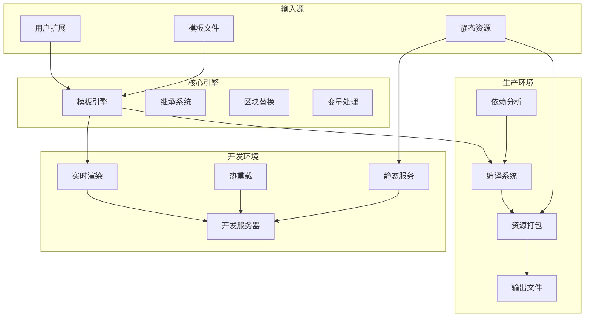

# HTML模板工具包
### 本包以 ESM 模块系统编写->未来趋势;只要你的 Node.js 版本大于22.12,可保留CJS `require()` 语法调用,否则请使用 `import` 语法;

## 架构概览



## 安装

```sh
# 初始化项目（如果尚未初始化）
npm init -y

# 本地安装（推荐）
npm i flun-html-template # 简写
# 或
# 全局安装
npm i -g flun-html-template # 简写

# flun其它npm家族安装包:
npm i flun-env     # .env 文件的环境变量调用
npm i flun-mail    # 邮件发送
npm i flun-windows # Window服务安装和管理
```
> **重要提示**：初次使用最好在空项目中执行安装，安装过程会自动安装示例和必要文件到根目录

---

## 快速开始

### 方式一：通过npm脚本（推荐）

在您的 `package.json` 中添加以下脚本：

```json
{
  "scripts": {
    "dev": "node dev.js",
    "build": "node build.js",
    "restoreDefaults": "node restoreDefaults.js"
  }
}
```

然后使用：
```sh
# 启动开发服务器（实时预览和热重载，默认不启用登录）
npm run dev

# 启动开发服务器并启用登录系统
npm run dev -- --account

# 编译模板（生成最终HTML文件）
npm run build
```

### 方式二：直接运行文件
```sh
# 启动开发服务器
node dev.js

# 启动开发服务器并启用登录系统
node dev.js --account

# 编译模板
node build.js
```

---

## 配置选项

### 自定义端口
- **命令行参数**：`node dev.js --port 8080` 或 `node dev.js -p 8080`
- **环境变量**：`PORT=8080 node dev.js`
- **编程方式**：
  ```javascript
  const { startDevServer } = require('flun-html-template');
  startDevServer({ port: 8080 });
  ```

### 热重载控制
- **启用**（默认）：`node dev.js` 或 `node dev.js --hot-reload`
- **禁用**：`node dev.js --no-hot-reload`
- **编程方式**：
```javascript
  const { startDevServer } = require('flun-html-template');
  startDevServer({ port: 7296, hotReload: true }); // 启用热重载(默认)
```
### 登录系统控制
- **启用**：`node dev.js --account`
- **禁用**（默认）：`node dev.js --no-account`
- **编程方式**：
```javascript
  const { startDevServer } = require('flun-html-template');
  startDevServer({ port: 7296, account: false }); // 禁用登录(默认)
```
### 自定义打包目录
- **编程方式**（默认输出到`dist`目录）：
```js
const { compile } = require('flun-html-template');
compile({ outputDir: 'dist' }); // 默认参数:目录名 dist;
```

## 模板标签使用指南

### 基础概念
1. **模板继承**：子模板中必须使用 `[extends base.html]` 声明继承关系(可以指定任意父html)
2. **区块覆盖**：如果没有引入区块标签，会默认继承基模板内容
3. **清空内容**：如需将基础模板的标签内容赋值为空，直接在子模板中引入该空标签

### 标签快捷输入方式
**HBuilder用户**：
1. 输入 `b!` 后按 Enter
2. 输入标签名，自动创建开闭标签对
HBuilder自定义代码块配置(HTML和js)：
```json
{
    "custom-tag": {
        "prefix": "b!",
        "body": [
            "[!${1}]",
            "\t$TM_SELECTED_TEXT$2",
            "[~${1}]"
        ],
        "description": "自动生成闭标签"
    }
}
```
**VS Code用户**：
1. 安装 "html-custom-tags" 扩展
2. 输入 `[!标签名]` 后按空格，自动输出 `[~标签名]`
***并且其还支持大部分语言语法高亮,标签特殊高亮,标签统计,标签一键全复制等功能***

---
## 项目维护

### 更新版本
```sh
npm update flun-html-template
```

### 恢复初始文件
```sh
# 基本命令（跳过已存在目录）
node ./node_modules/flun-html-template/copy-files.js

# 常用选项：
node ./node_modules/flun-html-template/copy-files.js --skip-files --verbose
```
**主参数(三选一)**：
- `--overwrite` - 覆盖已存在的文件和目录
- `--skip-files` - 跳过所有存在的文件（包括目录中的文件）
- `--skip-dirs` - 跳过已存在的目录（默认）
> **可选参数(二选一)**:
> - `--account`             启用登录模式（会复制 templates/account 和 customize/account.js）
> - `--no-account`          禁用登录模式,跳过复制上述文件/目录（默认）

> **可选参数**:
> - `--verbose`             详细模式,显示更多信息

> **帮助**：
> - `--help `   - 显示帮助信息

#### 编程方式
```javascript
const { initProject } = require('flun-html-template');

// 恢复初始文件的多种方式
initProject();                                        // 使用默认设置（跳过已存在目录）
initProject({ mode: 'overwrite', verbose: true });    // 覆盖所有包文件并显示详细信息
initProject({ mode: 'overwrite', verbose: false });   // 覆盖所有包文件并静默输出
initProject({ mode: 'skip-files', verbose: true });   // 跳过已存在文件并显示详细信息
initProject({ mode: 'skip-files', verbose: true, account: false }); // 跳过已存在文件，显示详细信息，并跳过恢复登录相关文件
```
---

## 工作流程

1. **安装包**：自动复制模板文件到项目根目录
2. **自定义开发**：修改HTML模板文件满足需求
3. **添加功能**：将自定义逻辑写入 `customize` 目录
4. **开发调试**：使用 `node dev.js` 运行开发服务器
5. **编译部署**：使用 `node build.js` 编译模板

> **注意**：编译只会打包 `customize`、`static` 目录及文件，和编译模板生成的文件。根据是否有自定义路由，动态创建 `server.js` 入口文件。

---

## 核心功能

### 模板引擎特性
- **继承机制**：`[extends base.html]` 实现模板层级结构
- **区块系统**：`[!blockName]` 和 `[~blockName]` 定义可替换内容区块
- **变量系统**：`{{variable}}` 语法支持动态内容、条件判断和循环处理 (条件判断支持20层嵌套)
- **包含功能**：`[include header.html]` 实现文件复用
- **用户函数**：支持自定义函数的注册与调用

### 开发服务器功能
- 自动将URL路径映射到对应模板文件
- 通过 `/static` 路径提供静态文件服务
- 模板结构验证与错误提示
- 用户功能热加载和页面热重载功能

### 登录系统支持
- 登录系统支持密码,2FA,硬件等验证;支持用户名或邮箱登录;
- 包含文件去重处理
- 按需生成Express服务入口
- 智能编译顺序控制

### 编译系统优势
- 分析模板依赖关系
- 包含文件去重处理
- 按需生成Express服务入口
- 智能编译顺序控制

## 附加功能

### 页面样式在线修改(需启用登录系统)
- 支持长按元素选择设置其各种属性样式(比如:边距,颜色,字体等等);
- 支持跳转到编辑器修改整个页面样式文件:
> - 编辑器功能: 颜色选择 · 编辑 · 自动补全 · 代码折叠 · 预览 · 保存应用· 取消

### 自定义拖动元素(默认支持主题图标和返回顶部图标)
- 登录系统额外支持编辑器和预览容器拖动

---

## 模板语法示例

### 条件判断
```html
{{if user.role === 'admin'}}
    <div>管理员面板</div>
{{else if user.role === 'editor'}}
    <div>编辑者面板</div>
{{else}}
    <div>访客面板</div>
{{endif}}
```

### 循环处理
```html
{{for product in products}}
    <div class="product-item">
        <h3>{{product.name}}</h3>
        <p>价格: {{product.price}}</p>
        <p>索引: {{product_index}}/是否是第一个: {{product_isFirst}}/是否是最后一个: {{product_isLast}}</p>
    </div>
{{empty}}
    <div class="empty-state">暂无产品信息</div>
{{endfor}}
```

### 循环控制
```html
<!-- for in -->
{{for item in list}}
  {{if item.hidden}}{{continue}}{{endif}}
  <div>{{item.name}}</div>
  {{if item_index >= 5}}{{break}}{{endif}}
{{endfor}}

<!-- key value -->
{{for key, value in companyInfo}}
    <p><strong>{{key}}:</strong> {{value}}</p>
{{endfor}}
```

### 表达式支持
- 数学运算：`{{a + b * c}}`
- 比较运算：`{{value > 10}}`
- 逻辑运算：`{{a && b || c}}`
- 三元运算符：`{{condition ? value1 : value2}}`
- 函数调用：`{{Math.max(a, b)}}`
- 属性访问：`{{user.profile.name}}`

---

## 扩展功能开发

### 自定义函数
```javascript
// 在 customize 目录中的文件
exports.functions = {
    formatCurrency: (amount, currency = '¥') => {
        return `${currency}${amount.toFixed(2)}`;
    },
    getGreeting: (user) => {
        const hour = new Date().getHours();
        if (hour < 12) return `早上好, ${user.name}!`;
        if (hour < 18) return `下午好, ${user.name}!`;
        return `晚上好, ${user.name}!`;
    }
};
```

### 自定义路由
```javascript
exports.setupRoutes = (app) => {
    app.get('/api/products', (req, res) => {
        const page = parseInt(req.query.page) || 1;
        const limit = parseInt(req.query.limit) || 10;
        res.json({ products: [], total: 0, page, limit });
    });

    // 自定义中间件
    app.use((req, res, next) => {
        console.log(`${new Date().toISOString()} - ${req.method} ${req.path}`);
        next();
    });
};
```

### 全局变量
```javascript
exports.variables = {
    siteName: "我的网站",
    copyrightYear: new Date().getFullYear()
};
```

# 安全机制说明

## 我们为您构建了多层安全防护

### 🔒 核心安全特性

**路径安全**
- 所有文件访问都限制在项目目录内
- 防止目录遍历攻击和越权访问

**代码执行安全**
- 表达式在隔离的沙箱环境中运行
- 禁用危险函数（`require`、`process`、`eval`等）
- 执行超时保护（1.5秒自动终止）

**数据安全**
- 阻止原型污染攻击（防护`__proto__`、`constructor`等）
- 自动过滤不安全的关键字
- 防止无限循环（最多10次迭代）

### 🛡️ 自动防护机制

**模板处理时自动启用：**
- 变量访问安全检查
- 函数调用权限控制
- 资源使用限制
- 恶意代码拦截

**用户无需额外配置**，所有安全防护在后台自动运行。

### 💡 使用建议

**安全做法：**
```html
<!-- 使用内置安全函数 -->
<p>{{user.utils.safeFormat(data)}}</p>

<!-- 包含可信文件 -->
[include header.html]
```

**避免做法：**
```html
<!-- 直接执行用户输入 -->
<p>{{userInput}}</p>

<!-- 动态包含未知文件 -->
[include {{dynamicPath}}]
```

### ⚠️ 重要提醒

虽然我们提供了多重安全防护，但您仍需：
1. 谨慎处理用户输入数据
2. 验证自定义函数的参数安全性
3. 定期更新到最新版本

> **安全是共同责任** - 我们负责引擎安全，您负责业务逻辑安全。

这些防护措施确保您的模板渲染过程安全可靠，让您可以专注于业务开发。

---

## 故障排除

### 常见问题
1. **模板不生效**：确保子模板开头有 `[extends base.html]`
2. **区块不显示**：检查开闭标签名称是否一致
3. **热重载失效**：确认修改的是模板或静态目录中的文件
4. **路由不工作**：检查是否正确定义了 `setupRoutes` 函数
5. **找不到函数**: 1.检查函数名是否正确,2.文件名•函数名的文件名是否正确,3.文件是否在"customize"目录内

### 获取帮助
如果遇到问题，可以：
1. 运行恢复初始文件脚本
2. 检查浏览器控制台错误信息
3. 确认文件路径和名称是否正确

---

此模板工具包提供了从开发到生产的完整解决方案,适合各种规模的Web项目开发;